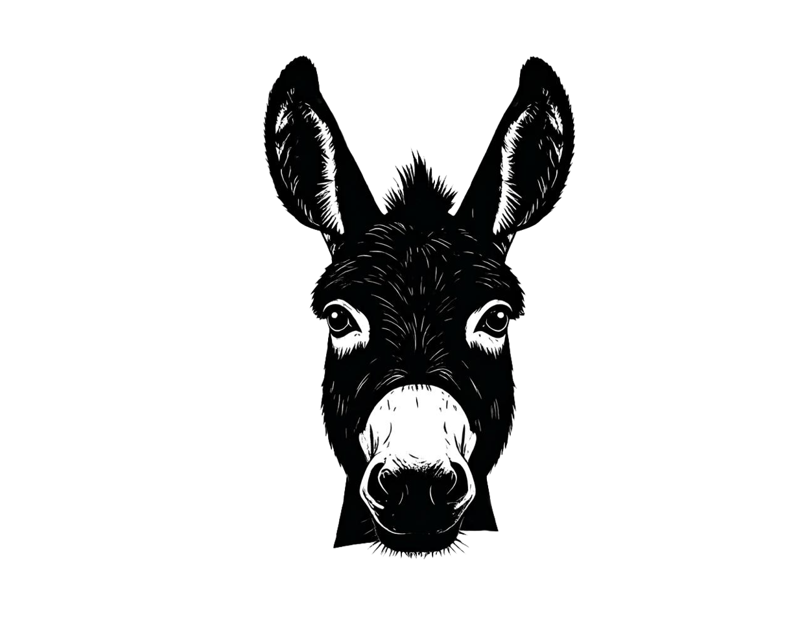

# 🦉 Night Owl Tab Manager

Easy session management - no more late night tabs

## ✨ Features

- **Session Management**: Save all your open tabs into named sessions
- **One-Click Restore**: Restore sessions in new windows with a single click
- **Export Functionality**: Export sessions as JSON files for backup or sharing
- **Theme Options**: Dark and light mode support
- **Clean Interface**: Developer-friendly UI with emoji placeholders
- **Auto-Focus**: Input automatically focused for quick session creation

## 🚀 Installation

### Development Mode
1. Open Chrome/Brave → Extensions
2. Enable "Developer mode"
3. Click "Load unpacked"
4. Select the extension folder

### Store Release
Coming soon to the Chrome Web Store.

## 💾 Export Format

Sessions are exported as JSON with session names as keys and URLs as arrays:

```json
{
  "Work Session": [
    "https://github.com/user/repo",
    "https://stackoverflow.com/questions/..."
  ],
  "Research Session": [
    "https://docs.example.com",
    "https://api.example.com"
  ]
}
```

## 🛠️ Usage

1. **Save Session**: Enter a session name and click "Save" to capture all current tabs
2. **Open Session**: Click "Open" on any saved session to restore tabs in a new window
3. **Edit Session**: Click on session names to rename them
4. **Export Sessions**: Go to Settings → Export Sessions to download JSON backup
5. **Theme Toggle**: Switch between dark/light themes in Settings

## 🏗️ Development

Built with vanilla JavaScript, HTML, and CSS. Clean, modular architecture with:

- Session management
- Theme handling
- Export functionality
- Utility functions

## 📋 Version History

### v1.1 (Current)
- ✅ Removed keyboard shortcuts for cleaner UX
- ✅ Added export functionality
- ✅ Improved code structure and readability
- ✅ Enhanced developer-focused UI
- ✅ Auto-focus on session input

### v1.0
- Basic session save/restore functionality
- Theme options
- Session editing capabilities

## 🔧 Made By



**[donkeydrills.com](https://donkeydrills.com)** - Software Development Solutions  
*Transitioning from Web2 to Web3*

## 📞 Contact & Repository

- **GitHub**: [https://github.com/vctrubio/Night-Owl-Brave-Extensension](https://github.com/vctrubio/Night-Owl-Brave-Extensension)
- **Email**: vctrubio@gmail.com
- **Issues**: Report bugs or request features on GitHub

## 🤝 Contributing

Feel free to open issues, submit PRs, or suggest improvements on the GitHub repository.

---

*Simplify your browsing workflow. Save tabs, restore sessions, stay organized.*
